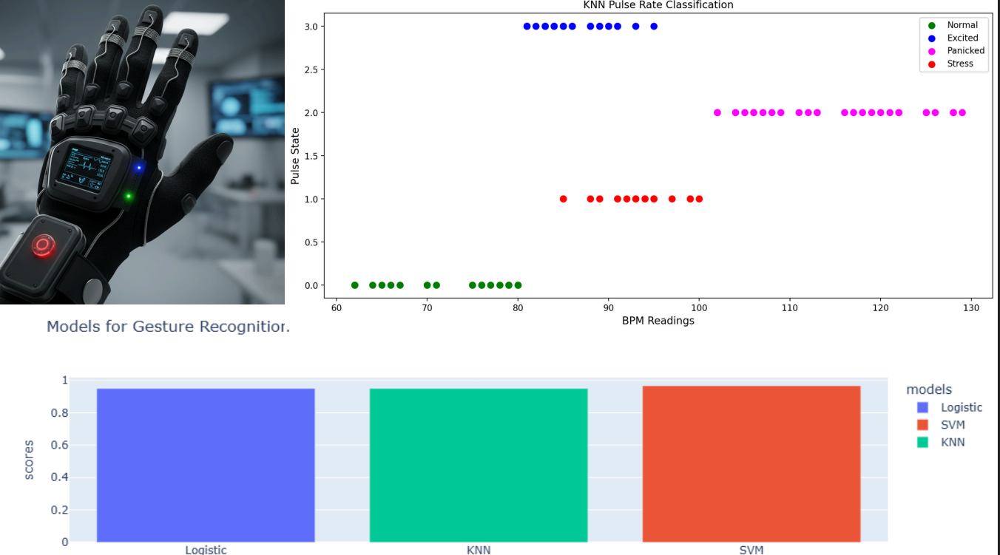

# <center>🧤 SignSense: AI Powered Smart Glove for Health Monitoring</center>

---

## 📌 Overview

**SignSense** is an IoT-based smart glove designed to integrate both gesture recognition and pulse rate monitoring for advanced health and assistive applications. Built with custom-made flex sensors, the glove captures fine hand movements and physiological signals in real-time. The collected data is processed using Machine Learning algorithms for accurate gesture classification and pulse state prediction.
<p align="center">
  
</p>

---

## 🚀 Features

* 🤖 **Gesture Recognition** using ML algorithms:

  * Logistic Regression
  * K-Nearest Neighbors (KNN)
  * Support Vector Machine (SVM)

* 💓 **Pulse Rate Monitoring** with **KNN-based prediction model**

* 🌐 **IoT Integration** for real-time data collection and monitoring

* 📊 **Classification of gestures and pulse states** with high accuracy

* 🖥️ **User-friendly interface** for real-time visualization

---

## 🛠️ Tech Stack

* **Programming Language**: Python
* **Frameworks**: Flask / PyCharm environment
* **Machine Learning**: Logistic Regression, KNN, SVM
* **IoT Components**: Sensors embedded in smart glove (Pulse sensor, Flex sensors)
* **Visualization**: Matplotlib / Web Dashboard

---

## 🔬 Working Principle

1. **Gesture Recognition** → Flex sensor data collected from the glove is processed using Logistic Regression, KNN, and SVM for accurate classification.
2. **Pulse Monitoring** → Heartbeat data from the pulse sensor is analyzed, and KNN is applied for pulse rate prediction.
3. **IoT Transmission** → Sensor data is transmitted to the cloud/local server for analysis and visualization.
4. **Output** → Classified gestures + predicted pulse states are displayed on the dashboard.

---

## 📂 Project Structure

```
SignSense/
│── data/                # Collected dataset (gestures + pulse readings)
│── models/              # Trained ML models (Logistic, KNN, SVM)
│── src/                 # Source code for training & IoT integration
│── static/              # Frontend assets (CSS, JS if Flask used)
│── templates/           # Web templates
│── README.md            # Project Documentation
```

---

## 📊 Example Applications

* 🩺 Health monitoring for patients
* ✋ Assistive technology for gesture-based communication
* ⚙️ Human-computer interaction projects

---

## 🔧 How to Run

```bash
# Clone this repository
git clone https://github.com/maroofgadiwale/signsense-gesture-iot.git

# Navigate into the folder
cd signsense-gesture-iot

# Install dependencies
pip install -r requirements.txt

# Run the app
python app.py
```

---

## 📌 Future Enhancements

* Integration with **Mobile App** for real-time alerts
* Adding **Deep Learning models** for higher accuracy
* Expanding dataset for more diverse gesture recognition

---

## 🤝 Developer

* **Maroof Gadiwale** – IT Student | Aspiring Data Scientist | ML Engineer ❤️

---

## 📜 License

This project is licensed under the **MIT License** – feel free to use.

---

<center>✨ Built with IoT & Machine Learning for Smarter Healthcare ✨</center>  
